<div align="center">

# olá, eu sou o Thiago

**fullstack** · TypeScript · React · mobile

construo produtos de ponta a ponta: painel web, app, API e o banco que segura o dado.

[](https://www.typescriptlang.org/)
[](https://react.dev/)
[](https://nextjs.org/)
[](https://expo.dev/)
[](https://nestjs.com/)
[](https://www.prisma.io/)
[](https://www.docker.com/)

</div>

---

## o que já construí

| projeto | o que é | stack |
|---|---|---|
| **Karavos** | CRM, briefing e produção de conteúdo | Next.js · React · TypeScript · Tailwind · PostgreSQL |
| **mchat** | chat web + mobile (monorepo) | Next.js · Expo · tRPC · Prisma · MariaDB · Redis |
| **Talentos** | gestão de talentos | PHP · React · Material UI · MySQL · Docker |
| **workshop** | site e admin de evento (WMRD-PR) | HTML/CSS/JS · TypeScript |
| **Maximizados** | site de comunidade, cursos e eventos | HTML · JavaScript · Vite |

---

## stack

```text
linguagens    TypeScript · JavaScript · PHP · Python
frontend      React · Next.js · Tailwind · Chakra UI · Material UI
mobile        React Native · Expo · Expo Router
backend       NestJS · tRPC · Prisma · NextAuth / JWT
dados         PostgreSQL · MySQL/MariaDB · Redis
infra         Docker · GitHub
```

---

## github

<div align="center">
  
  
</div>

<div align="center">
  
</div>

---

<div align="center">

obrigado por passar por aqui.

</div>
